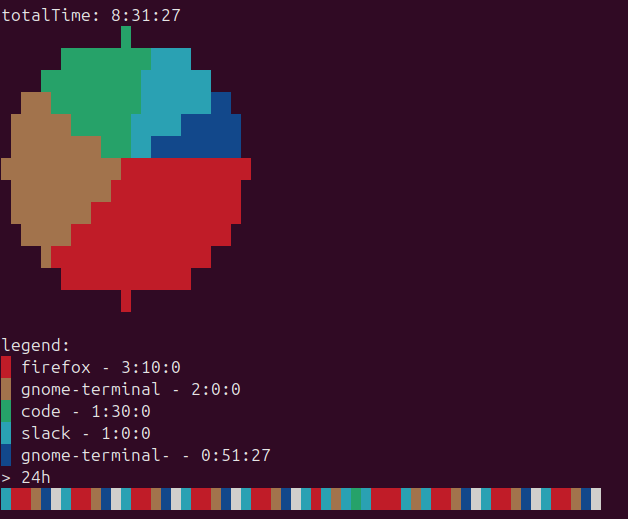
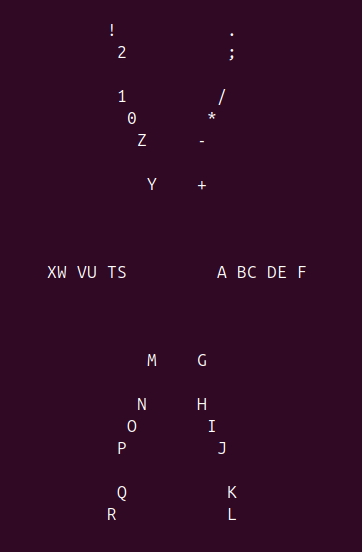
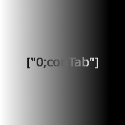
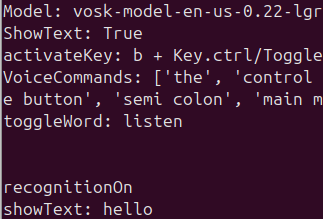

### pieStatistic
a linux time tracking program

tested on ubuntu and debian (no tray icon) (both x11)

  
  

### controller
controller to keyboard+ mouse also able to edit it tested on ubuntu x11 debian x11

### microphone
voice to text able to make voice commands Tested on ubuntu x11 debian x11

Voice recognition runs on vosk which can be downloaded at setup

  
  

